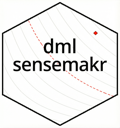

<!-- README.md is generated from README.Rmd. Please edit that file -->

```{r, include = FALSE}
knitr::opts_chunk$set(
  collapse = TRUE,
  cache = F,
  comment = "#>",
  fig.path = "man/figures/README-",
  out.width = "100%"
)
```

# dml.sensemakr: Sensitivity Analysis Tools for Causal ML 

<!-- badges: start -->
<!-- [](https://CRAN.R-project.org/package=dml.sensemakr) -->
<!-- [](https://cran.r-project.org/package=dml.sensemakr) -->
[](https://github.com/carloscinelli/dml.sensemakr/actions/workflows/R-CMD-check.yaml)
[](https://app.codecov.io/gh/carloscinelli/dml.sensemakr)
<!-- badges: end -->

`dml.sensemakr` implements a general suite of sensitivity analysis tools for Causal Machine Learning as discussed in [Chernozhukov, V., Cinelli, C., Newey, W., Sharma A., and Syrgkanis, V. (2026). "Long Story Short: Omitted Variable Bias in Causal Machine Learning." *Review of Economics and Statistics*.](https://doi.org/10.1162/REST.a.1705)


# Development version

To install the development version on GitHub make sure you have the package devtools installed.

```{r, eval = FALSE}
# install.packages("devtools") 
devtools::install_github("carloscinelli/dml.sensemakr")
```

# CRAN

CRAN version coming soon.


# Details

For theoretical details [please see the paper.](https://doi.org/10.1162/REST.a.1705) 

For a primer on Debiased Machine Learning, 
[please check Chernozukohv et al (2018).](https://academic.oup.com/ectj/article/21/1/C1/5056401) 

Some presentations that may be useful:

- [Carlos' presentation at the ICLR.](http://interactivecausallearning.com/Carlos_Cinelli.html)
- [Victor's tutorial at the Chamberlain Seminar.](https://www.youtube.com/watch?v=PQtYqKfxH_I)


# Basic Usage

```{r basic-usage, fig.align='center', collapse=T, dpi=300}
# loads package
library(dml.sensemakr)

## loads data
data("pension")

# set treatment, outcome and covariates
y <- pension$net_tfa  # net total financial assets
d <- pension$e401     # 401K eligibility
x <- model.matrix(~ -1 + age + inc  + educ+ fsize + marr + twoearn + pira + hown, data = pension)

# run DML (nonparametric model)
dml.401k <- dml(y, d, x, model = "npm")

# summary of results with median method (default)
summary(dml.401k)

# sensitivity analysis
sens.401k <- sensemakr(dml.401k, cf.y = 0.04, cf.d = 0.03)

# summary
summary(sens.401k)

# contout plots
plot(sens.401k)
```

# Acknowledgements

This project was partially supported by the Royalty Research Fund at the University of Washington, and by the National Science Foundation.

