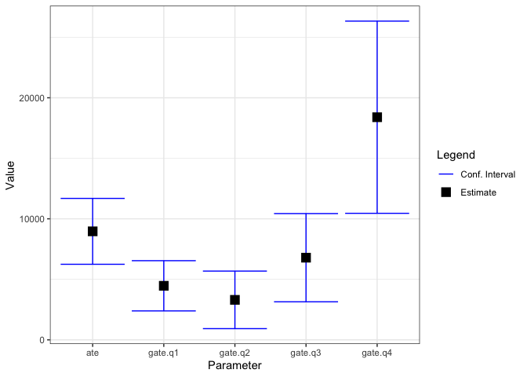
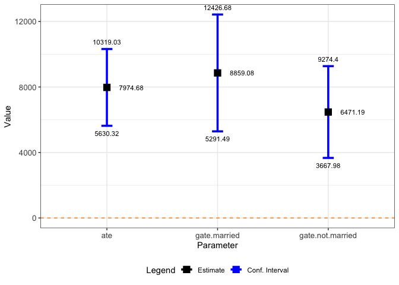
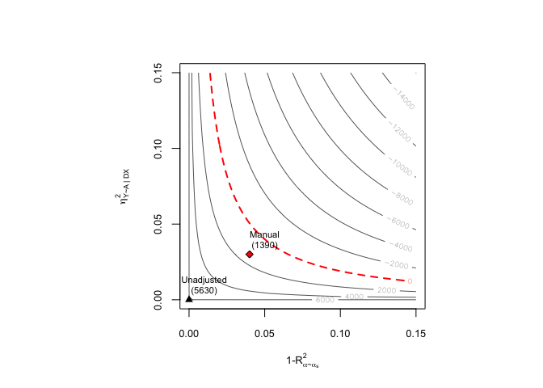

<!-- README.md is generated from README.Rmd. Please edit that file -->

# dml.sensemakr

<!-- badges: start -->
<!-- badges: end -->

## Development version

To install the development version on GitHub make sure you have the
package devtools installed.

``` r
# install.packages("devtools") 
devtools::install_github("carloscinelli/dml.sensemakr")
```

## Example

### Data

``` r
# loads package
library(dml.sensemakr)
#> See details in:
#> - Chernozhukov, V. Cinelli, C. Newey, W. Sharma, A. Syrgkanis, V. (2021). Long Story Short: Omitted Variable Bias in Causal Machine Learning. National Bureau of Economic Research, Working Paper Series, 30302.
#> - Available at: http://www.nber.org/papers/w30302

## loads data
data("pension")
y <- pension$net_tfa  # net total financial assets
d <-  pension$e401    # 401K eligibility
x <- model.matrix(~ -1 + age + inc  + educ+ fsize + marr + twoearn + pira + hown, data = pension)

## compute income quartiles
g1 <- cut(x[,"inc"], quantile(x[,"inc"], c(0, 0.25,.5,.75,1), na.rm = TRUE), 
          labels = c("q1", "q2", "q3", "q4"), include.lowest = T)
```

### Fit DML

``` r
# run DML (nonparametric model)
dml.401k <- dml(y, d, x, model = "npm", groups = g1, cf.folds = 5, cf.reps = 5)
#> Debiased Machine Learning
#> 
#> ======================================
#> Repeating 5-fold cross-fitting 5 times
#> ======================================
#> 
#> -- Rep 1 -- Folds: 1  2  3  4  5  
#> 
#> -- Rep 2 -- Folds: 1  2  3  4  5  
#> 
#> -- Rep 3 -- Folds: 1  2  3  4  5  
#> 
#> -- Rep 4 -- Folds: 1  2  3  4  5  
#> 
#> -- Rep 5 -- Folds: 1  2  3  4  5
```

### Explore results

``` r
# summary of results with median method (default)
summary(dml.401k)
#> 
#> Debiased Machine Learning
#> 
#>  Model: Nonparametric 
#>  Cross-Fitting: 5 folds, 5 reps 
#>  ML Method: outcome (ranger, R2 = 0.276), treatment (ranger, R2 = 0.115)
#>  Tuning: clean 
#> 
#> Average Treatment Effect: 
#> 
#>     Estimate Std. Error t value   P(>|t|)    
#> ate   8091.8     1195.1  6.7708 1.281e-11 ***
#> ---
#> Signif. codes:  0 '***' 0.001 '**' 0.01 '*' 0.05 '.' 0.1 ' ' 1
#> 
#> Group Average Treatment Effect: 
#> 
#>         Estimate Std. Error t value   P(>|t|)    
#> gate.q1  4358.58     829.27  5.2559 1.473e-07 ***
#> gate.q2  2742.43    1317.61  2.0814 0.0374009 *  
#> gate.q3  6927.60    1844.41  3.7560 0.0001726 ***
#> gate.q4 18439.90    4147.12  4.4464 8.731e-06 ***
#> ---
#> Signif. codes:  0 '***' 0.001 '**' 0.01 '*' 0.05 '.' 0.1 ' ' 1
#> 
#> Note: DML estimates combined using the median method.

# summary of results with mean method
summary(dml.401k, combine.method = "mean")
#> 
#> Debiased Machine Learning
#> 
#>  Model: Nonparametric 
#>  Cross-Fitting: 5 folds, 5 reps 
#>  ML Method: outcome (ranger, R2 = 0.273), treatment (ranger, R2 = 0.116)
#>  Tuning: clean 
#> 
#> Average Treatment Effect: 
#> 
#>     Estimate Std. Error t value   P(>|t|)    
#> ate   8099.2     1170.5  6.9193 4.539e-12 ***
#> ---
#> Signif. codes:  0 '***' 0.001 '**' 0.01 '*' 0.05 '.' 0.1 ' ' 1
#> 
#> Group Average Treatment Effect: 
#> 
#>         Estimate Std. Error t value   P(>|t|)    
#> gate.q1  4316.14     809.04  5.3349 9.560e-08 ***
#> gate.q2  2724.80    1279.89  2.1289 0.0332594 *  
#> gate.q3  6899.00    1830.30  3.7693 0.0001637 ***
#> gate.q4 18455.25    4030.60  4.5788 4.677e-06 ***
#> ---
#> Signif. codes:  0 '***' 0.001 '**' 0.01 '*' 0.05 '.' 0.1 ' ' 1
#> 
#> Note: DML estimates combined using the mean method.
```

### extract coefs, se, confidence intervals

``` r
# coef median method (default)
coef(dml.401k)
#>       ate   gate.q1   gate.q2   gate.q3   gate.q4 
#>  8091.825  4358.585  2742.432  6927.597 18439.900

# coef mean method (default)
coef(dml.401k, combine.method = "mean")
#>       ate   gate.q1   gate.q2   gate.q3   gate.q4 
#>  8099.238  4316.141  2724.799  6898.999 18455.247

# se median method (default)
se(dml.401k); 
#>      ate  gate.q1  gate.q2  gate.q3  gate.q4 
#> 1195.106  829.267 1317.615 1844.407 4147.123

# se median method (default)
se(dml.401k, combine.method = "mean")
#>       ate   gate.q1   gate.q2   gate.q3   gate.q4 
#> 1170.5315  809.0396 1279.8862 1830.2993 4030.5964

# confint median method (default)
confint(dml.401k) 
#>              2.5 %    97.5 %
#> ate      5749.4605 10434.189
#> gate.q1  2733.2512  5983.918
#> gate.q2   159.9547  5324.909
#> gate.q3  3312.6249 10542.569
#> gate.q4 10311.6876 26568.113

# confint mean method
confint(dml.401k, combine.method = "mean")
#>             2.5 %    97.5 %
#> ate      5805.039 10393.438
#> gate.q1  2730.452  5901.829
#> gate.q2   216.268  5233.330
#> gate.q3  3311.678 10486.319
#> gate.q4 10555.423 26355.071
```

### plot

``` r
plot(dml.401k)
```



### You can add groups after the model is fit

``` r
## compute GATE by married
g2 <- ifelse(pension$marr, "married", "not.married")
dml.401k.g2 <- dml_gate(dml.fit = dml.401k, groups = g2)
summary(dml.401k.g2)
#> 
#> Debiased Machine Learning
#> 
#>  Model: Nonparametric 
#>  Cross-Fitting: 5 folds, 5 reps 
#>  ML Method: outcome (ranger, R2 = 0.276), treatment (ranger, R2 = 0.115)
#>  Tuning: clean 
#> 
#> Average Treatment Effect: 
#> 
#>     Estimate Std. Error t value   P(>|t|)    
#> ate   8091.8     1195.1  6.7708 1.281e-11 ***
#> ---
#> Signif. codes:  0 '***' 0.001 '**' 0.01 '*' 0.05 '.' 0.1 ' ' 1
#> 
#> Group Average Treatment Effect: 
#> 
#>                  Estimate Std. Error t value   P(>|t|)    
#> gate.married       9245.9     1732.6  5.3364 9.479e-08 ***
#> gate.not.married   6257.6     1439.2  4.3480 1.374e-05 ***
#> ---
#> Signif. codes:  0 '***' 0.001 '**' 0.01 '*' 0.05 '.' 0.1 ' ' 1
#> 
#> Note: DML estimates combined using the median method.

coef(dml.401k.g2)
#>              ate     gate.married gate.not.married 
#>         8091.825         9245.915         6257.614
confint(dml.401k.g2)
#>                     2.5 %    97.5 %
#> ate              5749.460 10434.189
#> gate.married     5850.084 12641.746
#> gate.not.married 3436.865  9078.363
plot(dml.401k.g2)
```



## Sensitivity Analysis

### Robustness Values

``` r
robustness_value(dml.401k, alpha = 0.05)
#>         ate     gate.q1     gate.q2     gate.q3     gate.q4 
#> 0.046511790 0.071942007 0.008136323 0.037350432 0.059227556
```

### Confidence Bounds

``` r
confidence_bounds(dml.401k, r2ya.dx = 0.03, r2.rr = 0.04, level = 0.95)
#>                lwr        upr
#> ate      1609.3103 14629.8627
#> gate.q1  1591.3233  7200.4139
#> gate.q2 -1969.6733  6766.7145
#> gate.q3   288.5335 13347.5348
#> gate.q4  4945.2106 32061.7459
#> 
#> Confidence level: point = 95%; region = 90%.
#> Sensitivity parameters: r2ya.dx = 0.03; r2.rr = 0.04; rho2 = 1.
```

### Contour Plots

``` r
ovb_contour_plot(dml.401k, r2ya.dx = 0.03, r2.rr = 0.04, rho2 = 1,
                 bound.label = "Max Match (3x years)",
                 col.contour = "blue")
```



### Further results

``` r
bounds.401k <- dml_bounds(dml.401k, r2ya.dx = 0.03, r2.rr = 0.04)
bounds.401k
#> 
#> Debiased Machine Learning: Bounds on Omitted Variable Bias
#> 
#> Sensitivity Parameters
#>   r2ya.dx = 0.03
#>   r2rr = 0.04
#>   rho = 1 
#> 
#> Bounds on Average Treatment Effect: 
#> 
#>                Estimate Std. Error t value   P(>|t|)    
#> Short Estimate  8091.82    1195.11  6.7708 1.281e-11 ***
#> |Bias| Bound    4499.11     342.34 13.1423 < 2.2e-16 ***
#> Lower Bound     3626.44    1226.33  2.9572  0.003105 ** 
#> Upper Bound    12557.56    1259.87  9.9673 < 2.2e-16 ***
#> ---
#> Signif. codes:  0 '***' 0.001 '**' 0.01 '*' 0.05 '.' 0.1 ' ' 1
#> 
#> 
#> Bounds on Group Average Treatment Effect: Group q1 
#> 
#>                Estimate Std. Error t value   P(>|t|)    
#> Short Estimate  4358.58     829.27  5.2559 1.473e-07 ***
#> |Bias| Bound    1423.55     113.12 12.5840 < 2.2e-16 ***
#> Lower Bound     2930.82     814.36  3.5989 0.0003195 ***
#> Upper Bound     5786.35     859.69  6.7307 1.688e-11 ***
#> ---
#> Signif. codes:  0 '***' 0.001 '**' 0.01 '*' 0.05 '.' 0.1 ' ' 1
#> 
#> Bounds on Group Average Treatment Effect: Group q2 
#> 
#>                Estimate Std. Error t value   P(>|t|)    
#> Short Estimate  2742.43    1317.61  2.0814    0.0374 *  
#> |Bias| Bound    2109.02     439.79  4.7955 1.623e-06 ***
#> Lower Bound      627.07    1578.71  0.3972    0.6912    
#> Upper Bound     4857.79    1160.54  4.1858 2.842e-05 ***
#> ---
#> Signif. codes:  0 '***' 0.001 '**' 0.01 '*' 0.05 '.' 0.1 ' ' 1
#> 
#> Bounds on Group Average Treatment Effect: Group q3 
#> 
#>                Estimate Std. Error t value   P(>|t|)    
#> Short Estimate  6927.60    1844.41  3.7560 0.0001726 ***
#> |Bias| Bound    3367.48     575.31  5.8533 4.819e-09 ***
#> Lower Bound     3560.11    1988.98  1.7899 0.0734668 .  
#> Upper Bound    10295.08    1855.76  5.5476 2.896e-08 ***
#> ---
#> Signif. codes:  0 '***' 0.001 '**' 0.01 '*' 0.05 '.' 0.1 ' ' 1
#> 
#> Bounds on Group Average Treatment Effect: Group q4 
#> 
#>                Estimate Std. Error t value   P(>|t|)    
#> Short Estimate 18439.90    4147.12  4.4464 8.731e-06 ***
#> |Bias| Bound    6659.33     607.28 10.9658 < 2.2e-16 ***
#> Lower Bound    11750.35    4137.23  2.8401  0.004509 ** 
#> Upper Bound    25078.45    4245.54  5.9070 3.484e-09 ***
#> ---
#> Signif. codes:  0 '***' 0.001 '**' 0.01 '*' 0.05 '.' 0.1 ' ' 1
#> 
#> Note: DML estimates combined using the median method.
```

``` r
coef(bounds.401k)
#>                  ate  gate.q1   gate.q2   gate.q3   gate.q4
#> theta.s     8091.825 4358.585 2742.4319  6927.597 18439.900
#> bias.bound  4499.113 1423.555 2109.0171  3367.484  6659.332
#> theta.m     3626.439 2930.820  627.0744  3560.113 11750.345
#> theta.p    12557.559 5786.350 4857.7894 10295.081 25078.449
se(bounds.401k)
#>                  ate  gate.q1   gate.q2   gate.q3   gate.q4
#> theta.s    1195.1057 829.2670 1317.6146 1844.4074 4147.1235
#> bias.bound  342.3373 113.1245  439.7911  575.3132  607.2823
#> theta.m    1226.3274 814.3559 1578.7105 1988.9793 4137.2280
#> theta.p    1259.8713 859.6900 1160.5440 1855.7604 4245.5430
confint(bounds.401k)
#> $ate
#>                2.5 %    97.5 %
#> theta.s     5749.460 10434.189
#> bias.bound  3828.144  5170.082
#> theta.m     1222.882  6029.997
#> theta.p    10088.256 15026.861
#> 
#> $gate.q1
#>               2.5 %   97.5 %
#> theta.s    2733.251 5983.918
#> bias.bound 1201.835 1645.275
#> theta.m    1334.711 4526.928
#> theta.p    4101.388 7471.311
#> 
#> $gate.q2
#>                 2.5 %   97.5 %
#> theta.s      159.9547 5324.909
#> bias.bound  1247.0423 2970.992
#> theta.m    -2467.1414 3721.290
#> theta.p     2583.1649 7132.414
#> 
#> $gate.q3
#>                2.5 %    97.5 %
#> theta.s    3312.6249 10542.569
#> bias.bound 2239.8906  4495.077
#> theta.m    -338.2144  7458.441
#> theta.p    6657.8571 13932.304
#> 
#> $gate.q4
#>                2.5 %    97.5 %
#> theta.s    10311.688 26568.113
#> bias.bound  5469.080  7849.583
#> theta.m     3641.527 19859.163
#> theta.p    16757.338 33399.560
```
