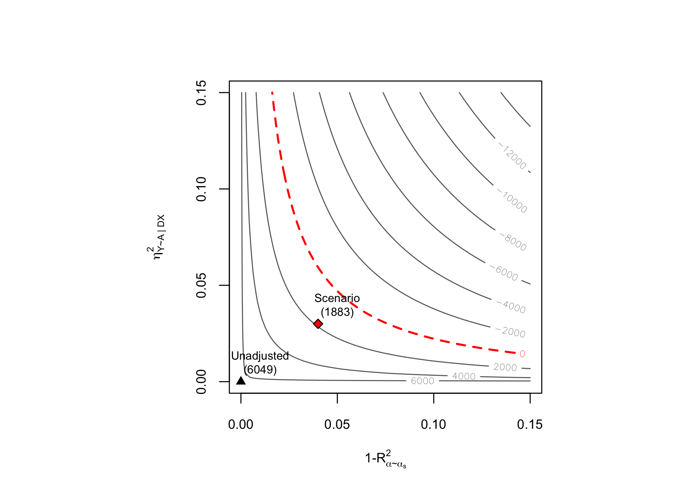

<!-- README.md is generated from README.Rmd. Please edit that file -->

# dml.sensemakr

<!-- badges: start -->
<!-- badges: end -->

`dml.sensemakr` implements a general suite of sensitivity analysis tools
for Causal Machine Learning as discussed in [Chernozhukov, V., Cinelli,
C., Newey, W., Sharma A., and Syrgkanis, V. (2021). “Long Story Short:
Omitted Variable Bias in Causal Machine
Learning.”](https://www.nber.org/papers/w30302)

# Development version

To install the development version on GitHub make sure you have the
package devtools installed.

``` r
# install.packages("devtools") 
devtools::install_github("carloscinelli/dml.sensemakr")
```

# CRAN

CRAN version coming soon.

# Details

For theoretical details [please see the working
paper.](https://www.nber.org/papers/w30302)

For a primer on Debiased Machine Learning, [please check Chernozukohv et
al (2018).](https://academic.oup.com/ectj/article/21/1/C1/5056401)

Some presentations that may be useful:

- [Carlos’ presentation at the
  ICLR.](http://interactivecausallearning.com/Carlos_Cinelli.html)
- [Victor’s tutorial at the Chamberlain
  Seminar.](https://www.youtube.com/watch?v=PQtYqKfxH_I)

# Basic Usage

``` r
# loads package
library(dml.sensemakr)
#> See details in:
#> - Chernozhukov, V. Cinelli, C. Newey, W. Sharma, A. Syrgkanis, V. (2021). Long Story Short: Omitted Variable Bias in Causal Machine Learning. National Bureau of Economic Research, Working Paper Series, 30302.
#> - Available at: http://www.nber.org/papers/w30302

## loads data
data("pension")

# set treatment, outcome and covariates
y <- pension$net_tfa  # net total financial assets
d <- pension$e401     # 401K eligibility
x <- model.matrix(~ -1 + age + inc  + educ+ fsize + marr + twoearn + pira + hown, data = pension)

# run DML (nonparametric model)
dml.401k <- dml(y, d, x, model = "npm")
#> Debiased Machine Learning
#> 
#>  Model: Nonparametric 
#>  Target: ate 
#>  Cross-Fitting: 5 folds, 1 reps 
#>  ML Method: outcome (ranger), treatment (ranger)
#>  Tuning: dirty 
#> 
#> 
#> ====================================
#> Tuning parameters using all the data
#> ====================================
#> 
#> - Tuning Model for D.
#> -- Best Tune:
#>   mtry min.node.size splitrule
#> 1    2             5  variance
#> 
#> - Tuning Model for Y (non-parametric).
#> -- Best Tune:
#>   mtry min.node.size splitrule
#> 1    3             5  variance
#> 
#> 
#> ======================================
#> Repeating 5-fold cross-fitting 1 times
#> ======================================
#> 
#> -- Rep 1 -- Folds: 1  2  3  4  5

# summary of results with median method (default)
summary(dml.401k)
#> 
#> Debiased Machine Learning
#> 
#>  Model: Nonparametric 
#>  Cross-Fitting: 5 folds, 1 reps 
#>  ML Method: outcome (ranger, R2 = 27.684%), treatment (ranger, R2 = 11.417%)
#>  Tuning: dirty 
#> 
#> Average Treatment Effect: 
#> 
#>         Estimate Std. Error t value  P(>|t|)    
#> ate.all     8305       1151   7.217 5.33e-13 ***
#> ---
#> Signif. codes:  0 '***' 0.001 '**' 0.01 '*' 0.05 '.' 0.1 ' ' 1
#> Note: DML estimates combined using the median method.
#> 
#> Verbal interpretation of DML procedure:
#> 
#> -- Average treatment effects were estimated using DML with 5-fold cross-fitting. In order to reduce the variance that stems from sample splitting, we repeated the procedure 1 times. Estimates are combined using the median as the final estimate, incorporating variation across experiments into the standard error as described in Chernozhukov et al. (2018). The outcome regression uses Random Forest from the R package ranger; the treatment regression uses Random Forest from the R package ranger.

# sensitivity analysis
sens.401k <- sensemakr(dml.401k, cf.y = 0.03, cf.d = 0.04)

# summary
summary(sens.401k)
#> ==== Original Analysis ====
#> 
#> Debiased Machine Learning
#> 
#>  Model: Nonparametric 
#>  Cross-Fitting: 5 folds, 1 reps 
#>  ML Method: outcome (ranger, R2 = 27.684%), treatment (ranger, R2 = 11.417%)
#>  Tuning: dirty 
#> 
#> Average Treatment Effect: 
#> 
#>         Estimate Std. Error t value  P(>|t|)    
#> ate.all     8305       1151   7.217 5.33e-13 ***
#> ---
#> Signif. codes:  0 '***' 0.001 '**' 0.01 '*' 0.05 '.' 0.1 ' ' 1
#> Note: DML estimates combined using the median method.
#> 
#> Verbal interpretation of DML procedure:
#> 
#> -- Average treatment effects were estimated using DML with 5-fold cross-fitting. In order to reduce the variance that stems from sample splitting, we repeated the procedure 1 times. Estimates are combined using the median as the final estimate, incorporating variation across experiments into the standard error as described in Chernozhukov et al. (2018). The outcome regression uses Random Forest from the R package ranger; the treatment regression uses Random Forest from the R package ranger.
#> 
#> ==== Sensitivity Analysis ====
#> 
#> Null hypothesis: theta = 0 
#> Signif. level: alpha = 0.05 
#> 
#> Robustness Values:
#>         RV (%) RVa (%)
#> ate.all 6.3342  4.8512
#> 
#> Verbal interpretation of robustness values:
#> 
#> -- Robustness Value for the Bound (RV): omitted variables that explain more than RV% of the residual variation of the outcome (cf.y) and generate an additional RV% of variation on the Riesz Representer (cf.d) are sufficiently strong to make the estimated bounds include 0. Conversely, omitted variables that do not explain more than RV% of the residual variation of the outcome nor generate an additional RV% of variation on the Riesz Representer are not sufficiently strong to do so.
#> 
#> -- Robustness Value for the Confidence Bound (RVa): omitted variables that explain more than RV% of the residual variation of the the outcome (cf.y) and generate an additional RV% of variation on the Riesz Representer (cf.d) are sufficiently strong to make the confidence bounds include 0, at the  significance level of alpha = 0.05. Conversely, omitted variables that do not explain more than RV% of the residual variation of the outcome nor generate an additional RV% of variation on the Riesz Representer are not sufficiently strong to do so. 
#> 
#>  The interpretation of sensitivity parameters can be further refined for each target quantity. See more below.
#> 
#> Confidence Bounds for Sensitivity Scenario:
#>               lwr       upr
#> ate.all  1883.244 14790.218
#> 
#> Confidence level: point = 95%; region = 90%.
#> Sensitivity parameters: cf.y = 0.03; cf.d = 0.04; rho2 = 1.
#> 
#> Verbal interpretation of confidence bounds:
#> 
#> -- The table shows the lower (lwr) and upper (upr) limits of the confidence bounds on the target quantity, considering omitted variables with postulated sensitivity parameters cf.y, cf.d and rho2. The confidence level "point" is the relevant coverage for most use cases, and stands for the coverage rate for the true target quantity. The confidence level "region" stands for the coverage rate of the true bounds.
#> 
#> Interpretation of sensitivity parameters:
#> 
#> -- cf.y: percentage of the residual variation of the outcome explained by latent variables.
#> -- cf.d: percentage gains in the variation of the Riesz Representer generated by latent variables:
#>    ATE: cf.d measures the percentage gains in the average precision on the treatment regression.

# contout plots
plot(sens.401k)
```



<!-- ### Use DML to estimate the ATE -->
<!-- ```{r} -->
<!-- ``` -->
<!-- ### Explore results -->
<!-- ```{r} -->
<!-- ``` -->
<!-- ### Extract coefs, se, confidence intervals -->
<!-- ```{r} -->
<!-- # coef median method (default) -->
<!-- coef(dml.401k, combine.method = "median") -->
<!-- # se median method (default) -->
<!-- se(dml.401k, combine.method = "median") -->
<!-- # confint median method -->
<!-- confint(dml.401k, combine.method = "median") -->
<!-- ``` -->
<!-- ### Coefficients Plot -->
<!-- ```{r} -->
<!-- plot(dml.401k) -->
<!-- ``` -->
<!-- ### You can add groups after the model is fit -->
<!-- ```{r} -->
<!-- ## compute GATE by married -->
<!-- g2 <- ifelse(pension$marr, "married", "not.married") -->
<!-- dml.401k.g2 <- dml_gate(dml.fit = dml.401k, groups = g2) -->
<!-- summary(dml.401k.g2) -->
<!-- coef(dml.401k.g2) -->
<!-- confint(dml.401k.g2) -->
<!-- plot(dml.401k.g2) -->
<!-- ``` -->
<!-- ## Sensitivity Analysis -->
<!-- ### Robustness Values -->
<!-- ```{r} -->
<!-- ``` -->
<!-- ### Confidence Bounds -->
<!-- ```{r} -->
<!-- ``` -->
<!-- ### Contour Plots -->
<!-- ```{r, fig.width=12} -->
<!-- ``` -->
<!-- ### Further results -->
<!-- ```{r} -->
<!-- bounds.401k <- dml_bounds(dml.401k, cf.y = 0.03, cf.d = 0.04) -->
<!-- bounds.401k -->
<!-- ``` -->
<!-- ```{r} -->
<!-- coef(bounds.401k) -->
<!-- se(bounds.401k) -->
<!-- confint(bounds.401k) -->
<!-- ``` -->
