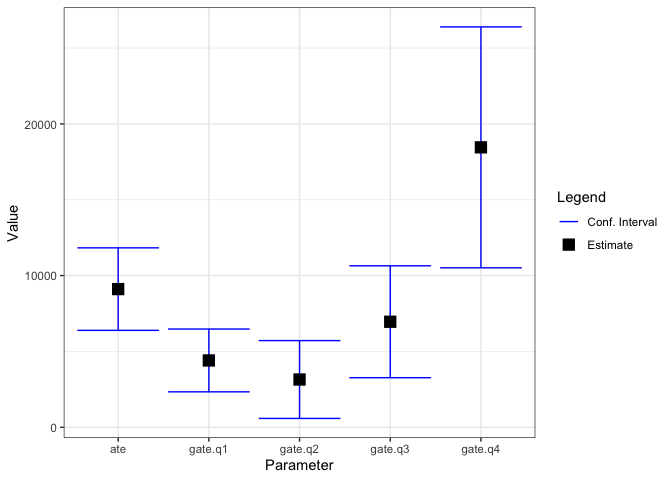

<!-- README.md is generated from README.Rmd. Please edit that file -->

# dml.sensemakr

<!-- badges: start -->
<!-- badges: end -->

## Development version

To install the development version on GitHub make sure you have the
package devtools installed.

``` r
# install.packages("devtools") 
devtools::install_github("carloscinelli/dml.sensemakr")
```

## Example

``` r
# loads package
library(dml.sensemakr)

## loads data
data("pension")
y <- pension$net_tfa  # net total financial assets
d <-  pension$e401    # 401K eligibility
x <- model.matrix(~ -1+ age + inc  + educ+ fsize+marr + twoearn + pira + hown, data = pension)

# run DML (partially linear model)
dml.fit <- dml(y, d, x, model = "plm", cf.folds = 5, cf.reps = 5)
#> Debiased Machine Learning
#> 
#> ======================================
#> Repeating 5-fold cross-fitting 5 times
#> ======================================
#> 
#> -- Rep 1 -- Folds: 1  2  3  4  5  
#> 
#> -- Rep 2 -- Folds: 1  2  3  4  5  
#> 
#> -- Rep 3 -- Folds: 1  2  3  4  5  
#> 
#> -- Rep 4 -- Folds: 1  2  3  4  5  
#> 
#> -- Rep 5 -- Folds: 1  2  3  4  5

# short description of results
dml.fit
#> 
#> Debiased Machine Learning
#> 
#> Call:
#> dml(y = y, d = d, x = x, model = "plm", cf.folds = 5, cf.reps = 5)
#> 
#> Estimates:
#>  ate  
#> 9109

# longer summary of results
summary(dml.fit)
#> 
#> Debiased Machine Learning
#> 
#>  Model: Partially Linear 
#>  Cross-Fitting: 5 folds, 5 reps 
#>  ML Method: outcome (ranger, R2 = 0.268), treatment (ranger, R2 = 0.116)
#>  Tuning: clean 
#> 
#> Average Treatment Effect: 
#> 
#>     Estimate Std. Error t value   P(>|t|)    
#> ate   9108.9     1387.6  6.5647 5.215e-11 ***
#> ---
#> Signif. codes:  0 '***' 0.001 '**' 0.01 '*' 0.05 '.' 0.1 ' ' 1
#> Note: DML estimates combined using the median method.

# change pooling method to "mean"
summary(dml.fit, combine.method = "mean")
#> 
#> Debiased Machine Learning
#> 
#>  Model: Partially Linear 
#>  Cross-Fitting: 5 folds, 5 reps 
#>  ML Method: outcome (ranger, R2 = 0.262), treatment (ranger, R2 = 0.116)
#>  Tuning: clean 
#> 
#> Average Treatment Effect: 
#> 
#>     Estimate Std. Error t value   P(>|t|)    
#> ate   9022.7     1335.3  6.7572 1.407e-11 ***
#> ---
#> Signif. codes:  0 '***' 0.001 '**' 0.01 '*' 0.05 '.' 0.1 ' ' 1
#> Note: DML estimates combined using the median method.

# extract coefs, se, confidence intervals
coef(dml.fit); coef(dml.fit, combine.method = "mean")
#>      ate 
#> 9108.922
#>      ate 
#> 9022.731
se(dml.fit); se(dml.fit, combine.method = "mean")
#>      ate 
#> 1387.569
#>      ate 
#> 1335.274
confint(dml.fit); confint(dml.fit, combine.method = "mean")
#>        2.5 %   97.5 %
#> ate 6389.337 11828.51
#>        2.5 %   97.5 %
#> ate 6405.642 11639.82

# group average treatment effects (GATEs)
## compute income quartiles
g1 <- cut(x[,"inc"], quantile(x[,"inc"], c(0, 0.25,.5,.75,1), na.rm = TRUE), 
          labels = c("q1", "q2", "q3", "q4"), include.lowest = T)

## compute GATEs
dml.g1 <- dml_gate(dml.fit = dml.fit, groups = g1)
dml.g1
#> 
#> Debiased Machine Learning
#> 
#> Call:
#> dml(y = y, d = d, x = x, model = "plm", cf.folds = 5, cf.reps = 5)
#> 
#> Estimates:
#>     ate  gate.q1  gate.q2  gate.q3  gate.q4  
#>    9109     4405     3148     6956    18455

summary(dml.g1)
#> 
#> Debiased Machine Learning
#> 
#>  Model: Partially Linear 
#>  Cross-Fitting: 5 folds, 5 reps 
#>  ML Method: outcome (ranger, R2 = 0.268), treatment (ranger, R2 = 0.116)
#>  Tuning: clean 
#> 
#> Average Treatment Effect: 
#> 
#>     Estimate Std. Error t value   P(>|t|)    
#> ate   9108.9     1387.6  6.5647 5.215e-11 ***
#> ---
#> Signif. codes:  0 '***' 0.001 '**' 0.01 '*' 0.05 '.' 0.1 ' ' 1
#> 
#> Group Average Treatment Effect: 
#> 
#>         Estimate Std. Error t value   P(>|t|)    
#> gate.q1   4405.2     1056.3  4.1702 3.043e-05 ***
#> gate.q2   3147.6     1309.2  2.4042 0.0162088 *  
#> gate.q3   6955.7     1882.4  3.6952 0.0002197 ***
#> gate.q4  18454.9     4052.1  4.5544 5.254e-06 ***
#> ---
#> Signif. codes:  0 '***' 0.001 '**' 0.01 '*' 0.05 '.' 0.1 ' ' 1
#> 
#> Note: DML estimates combined using the median method.
coef(dml.g1)
#>       ate   gate.q1   gate.q2   gate.q3   gate.q4 
#>  9108.922  4405.175  3147.563  6955.690 18454.903
confint(dml.g1)
#>              2.5 %    97.5 %
#> ate      6389.3374 11828.507
#> gate.q1  2334.7765  6475.574
#> gate.q2   581.5702  5713.556
#> gate.q3  3266.3101 10645.070
#> gate.q4 10512.8620 26396.945
plot(dml.g1)
```


